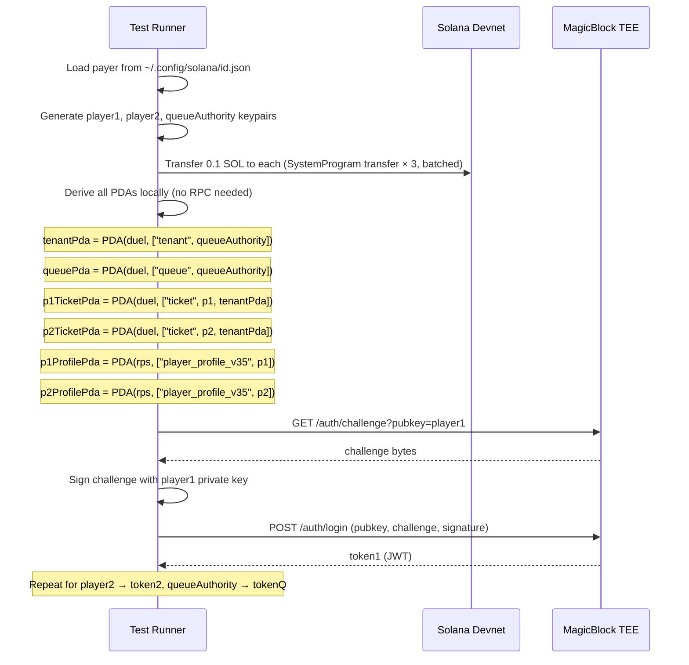
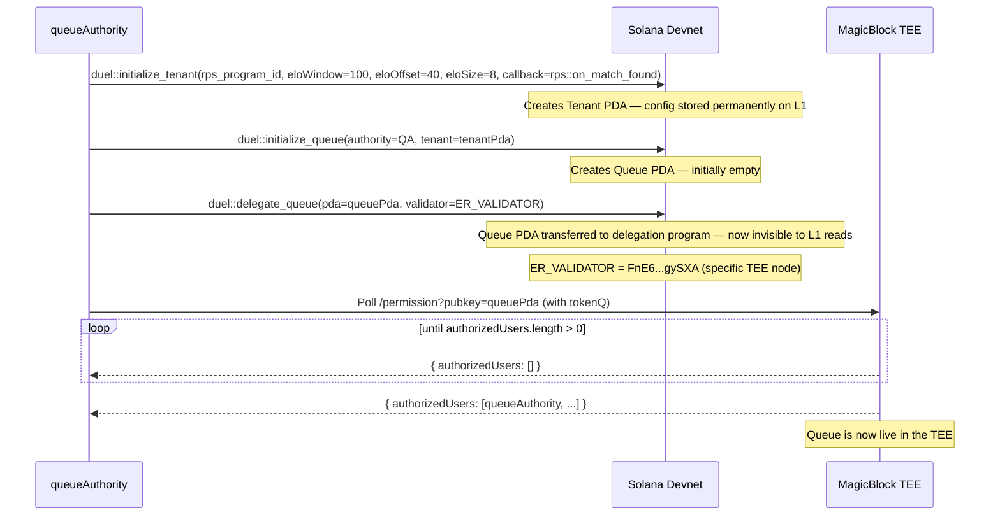
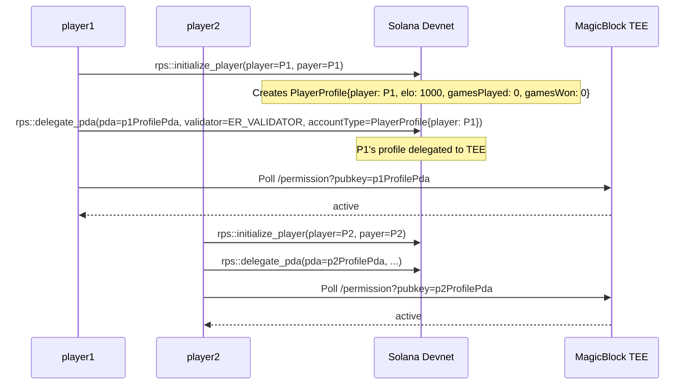
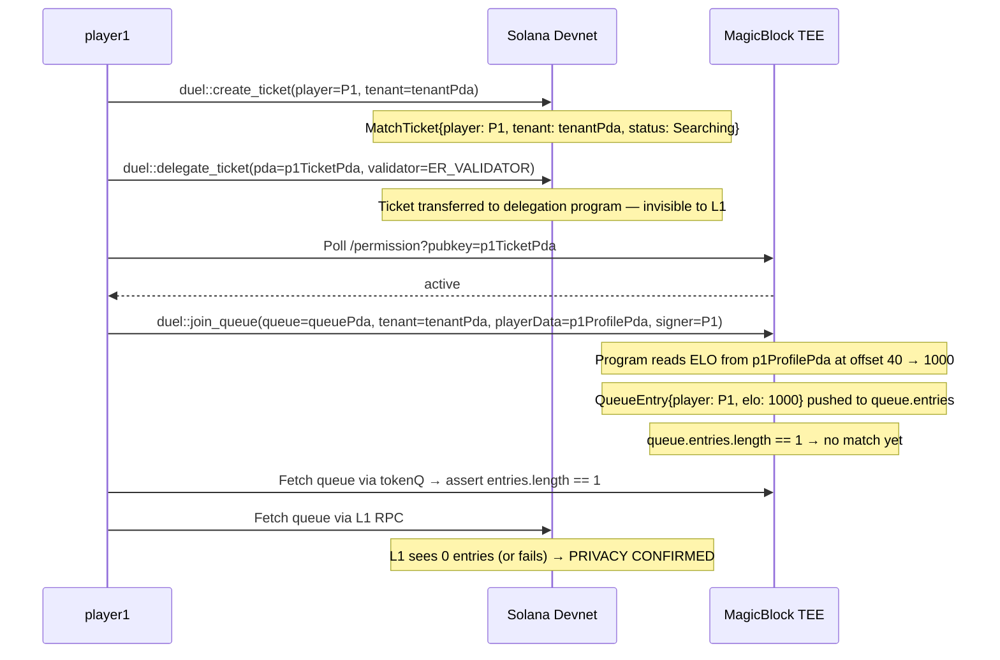
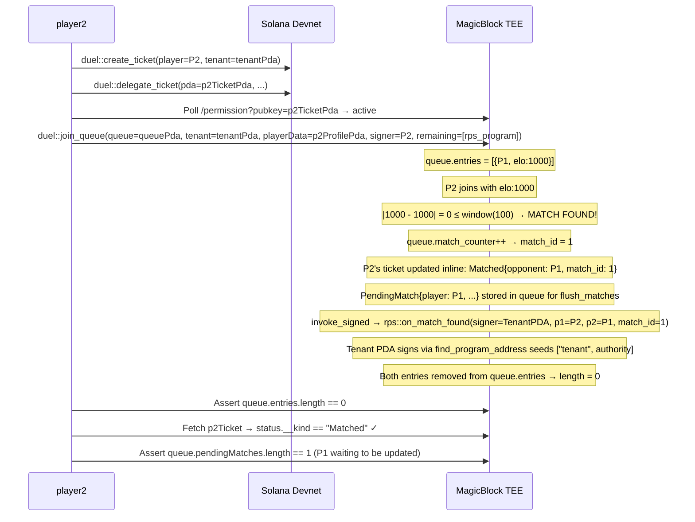
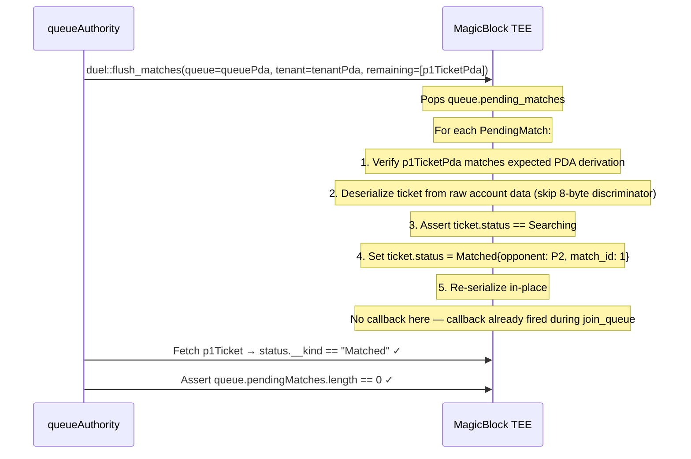
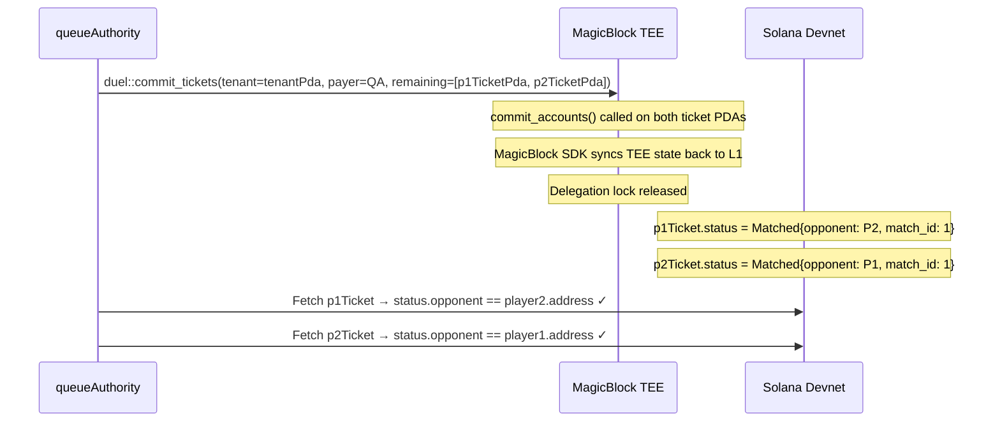
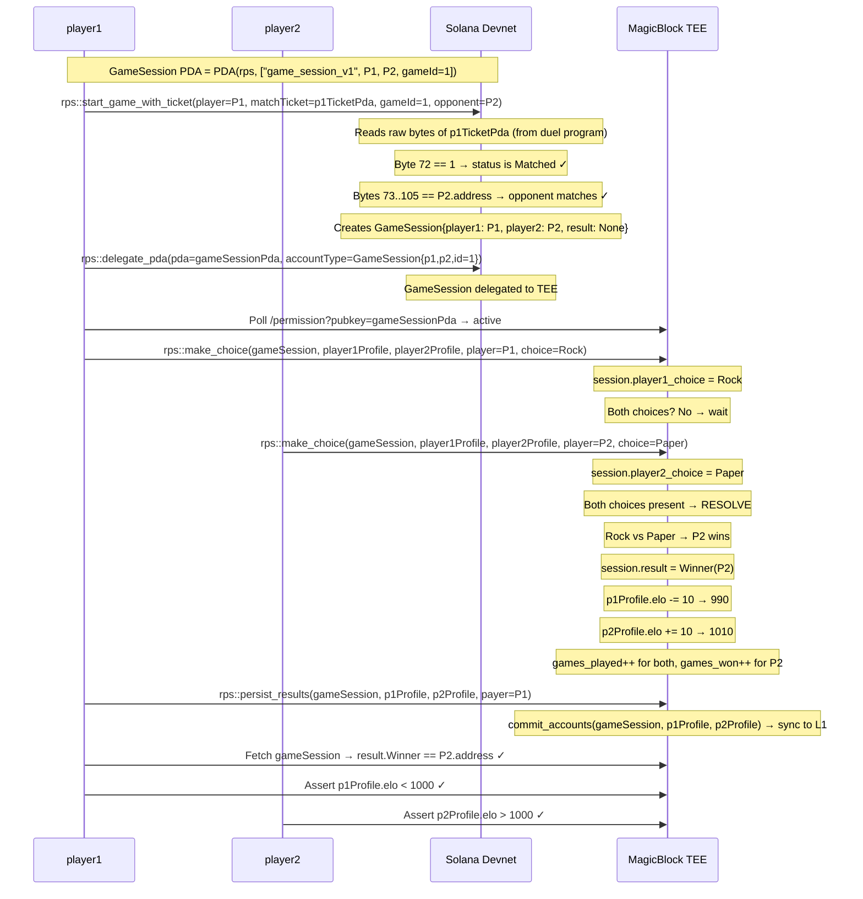
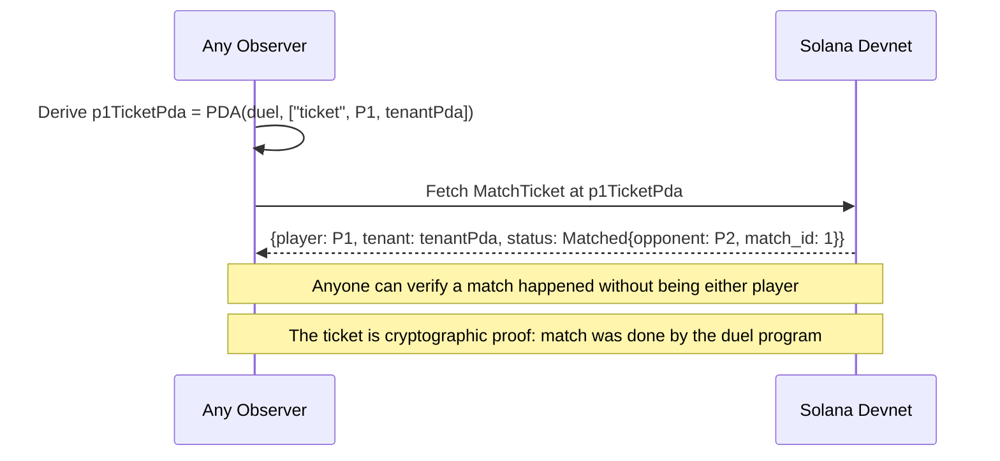
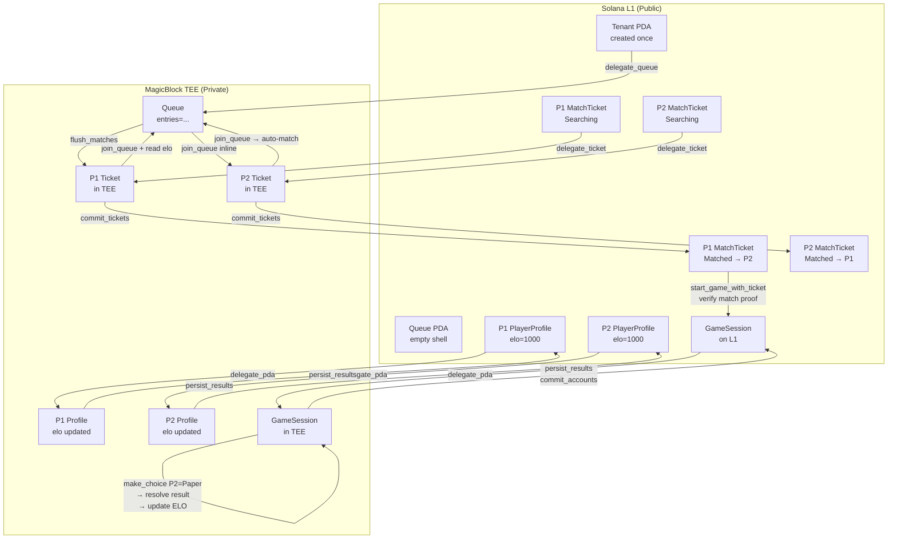

# Project Understanding: Duel

## What This Project Is

**Duel** is a reusable, privacy-preserving matchmaking protocol for Solana. It is **not a game** — it is infrastructure that any game can plug into.

The core idea: match players based on ELO inside a Trusted Execution Environment (TEE) so the queue is invisible to the public. Only the final match result gets committed back to Solana L1 as a cryptographic proof.

**RPS (Rock-Paper-Scissors) is just an example.** It exists in this repo purely to demonstrate how a game integrates with the Duel protocol. Any game that has a player account with an ELO field can become a Duel tenant by configuring:
- Which program owns player accounts
- Where ELO lives in the account data (byte offset + type)
- What ELO window to use for matching
- An optional callback to invoke when a match is found

The `duel` program and its SDK are the deliverable. The RPS game and the frontend are reference implementations.

---

## Programs

### `duel` — The Protocol (the real product)
Program ID: `EdZzUwKd1X2ZWjxLPpz1cpEzMF7RUZC43Pq64v1VcK5X`

Owns these on-chain accounts:
| Account | PDA Seeds | Purpose |
|---|---|---|
| `Tenant` | `["tenant", authority]` | Config: which game program, ELO field layout, callback |
| `Queue` | `["queue", authority]` | The matchmaking queue (delegated to TEE) |
| `MatchTicket` | `["ticket", player, tenantPda]` | Per-player receipt. Created on L1, delegated to TEE, committed back |

Key instructions:
- `initialize_tenant` — one-time config per queue operator
- `initialize_queue` — creates the queue PDA linked to the tenant
- `delegate_queue` / `delegate_ticket` — hands account ownership to the TEE delegation program
- `join_queue` — TEE-only: inserts player into queue, auto-matches on ELO window
- `flush_matches` — TEE-only: updates the *opponent's* ticket (the joiner's ticket is already updated inline in `join_queue`)
- `commit_tickets` — TEE-only: pushes matched ticket state back to L1

### `rps-game` — Example Consumer (demo only, not the product)
Program ID: `8ohu3RobXyZ2DebyJjbs2co9YCG275FUsVckEcmDbCos`

Owns these on-chain accounts:
| Account | PDA Seeds | Purpose |
|---|---|---|
| `PlayerProfile` | `["player_profile_v35", player]` | ELO, games played/won |
| `GameSession` | `["game_session_v1", p1, p2, gameId]` | One game's state |

Key instructions:
- `initialize_player` — creates a fresh profile (ELO starts at 1000)
- `delegate_pda` — delegates either a `PlayerProfile` or `GameSession` to TEE
- `start_game_with_ticket` — verifies the `MatchTicket` on L1 before creating the game session
- `make_choice` — TEE-only: records Rock/Paper/Scissors, resolves result when both chose, updates ELO
- `persist_results` — TEE-only: commits game session + both profiles back to L1
- `on_match_found` — CPI callback endpoint, called by duel's `join_queue` via Tenant PDA (`invoke_signed`)

---

## Infrastructure: L1 vs TEE

```
┌──────────────────────────────────────────────────────────────┐
│  Solana Devnet (L1)                                          │
│  Public, permanent, expensive                                │
│  - Tenant PDA (config)                                       │
│  - MatchTicket PDAs (before + after delegation)              │
│  - PlayerProfile PDAs (before + after delegation)            │
│  - GameSession PDA (after persist_results commit)            │
└──────────────────────────────────────────────────────────────┘
         ▲ delegate / commit (state sync)
         │
┌──────────────────────────────────────────────────────────────┐
│  MagicBlock TEE (Ephemeral Rollup)                           │
│  Private, fast, cheap                                        │
│  - Queue PDA (invisible to L1 while delegated)               │
│  - MatchTickets (while player is searching/matched)          │
│  - PlayerProfiles (ELO updated here during games)            │
│  - GameSession (live game state)                             │
└──────────────────────────────────────────────────────────────┘
```

**Delegation** = the account's ownership is transferred from the Solana program to the MagicBlock delegation program (`DELeGGvXpWV2fqJUhqcF5ZSYMS4JTLjteaAMARRSaeSh`). While delegated, L1 sees the account as locked/unreadable by its original program.

**Commit** = the TEE pushes the current delegated state back to L1 and releases the delegation lock.

**TEE Auth** = each actor (player1, player2, queueAuthority) authenticates with the TEE via a challenge-sign HTTP flow (`/auth/challenge` → sign with wallet → `/auth/login` → JWT token). Subsequent RPC calls include `?token=<jwt>` in the URL.

---

## The ELO Bridge

The `Tenant` config teaches `duel` how to read ELO from any game's player account:

```
eloOffset: 8 + 32 = 40   ← skip 8-byte discriminator + 32-byte player pubkey
eloDataType: "u64"        ← read 8 bytes as little-endian u64
eloWindow: 100n           ← max ELO difference for a match
```

This is what makes the matchmaking engine **generic** — it doesn't know about RPS specifically, it just reads an ELO number at a known offset from whatever account the tenant program manages.

---

## Test File: Step-by-Step

### Setup (`before`)



**What we have after setup:** 3 funded wallets, 6 derived PDAs, 3 JWT tokens for TEE auth.

---

### Test 1: Initialize Infrastructure & Delegate Queue



**On-chain state after:** `Tenant` exists on L1. `Queue` is delegated (owned by delegation program on L1, visible and writable inside TEE).

---

### Test 2: Initialize Player Profiles & Delegate



**Why delegate profiles to TEE?** So `make_choice` (which updates ELO) can run inside the TEE without going through L1. The TEE reads ELO directly from the delegated profile when P1 joins the queue.

---

### Test 3: P1 Creates Ticket, Delegates, Joins Queue



**Key insight:** `join_queue` runs on the TEE. The queue account is delegated, so all mutations happen inside the TEE. L1 cannot see the current queue state.

---

### Test 4: P2 Joins Queue → Auto-Match Fires



**Atomicity:** When P2 joins and triggers the match, both the match result AND the callback fire in the same `join_queue` transaction. P2's ticket is updated inline (it's a named account). P1's ticket goes into `PendingMatch` for `flush_matches` to handle — but both players receive the callback atomically from the same tx.

---

### Test 5: Flush Matches (Update P1's Ticket)



**Why flush_matches is separate:** When `join_queue` fires, only the joining player's ticket is in the named accounts. The opponent's ticket must be updated via `flush_matches`, which takes it as a `remaining_account`. The callback is NOT repeated here — it already fired once during `join_queue`.

---

### Test 6: Commit Tickets to L1



**After commit:** Both tickets are back on L1 with `Matched` status. This is the public proof that a match happened.

---

### Test 7: Play Game (Start, Moves, Persist)



---

### Test 8: Third-Party Verification



---

## Full Flow in One Diagram



---

## Known Design Decisions / Things to Confirm

### Things I'm confident about
- The queue is **truly private** while delegated — L1 cannot see who is searching
- The `MatchTicket` is the player's **proof of match** on L1 — anyone can verify it
- ELO is read generically from any account at a configured byte offset — the matchmaker is game-agnostic
- `flush_matches` requires the caller to pass opponent ticket PDAs as `remaining_accounts` — this is intentional (permissionless crank design)
- The `on_match_found` callback is CPI-called during `join_queue` via **Tenant PDA** (`invoke_signed`), not during `flush_matches`
- The Tenant PDA is an unforgeable signer — only the duel program can produce it; game devs can verify the callback is authentic without any extra access control

### Things that may need alignment

1. **`start_game_with_ticket` reads raw ticket bytes** — it hardcodes byte offset 72 for the status discriminator and 73..105 for the opponent. This is fragile. If `MatchTicket` layout changes, the game program breaks silently.

2. **`gameId` is hardcoded to `1n` in the test** — in production, who assigns game IDs? Currently the client decides. Two players could race and create different sessions with the same ID.

3. **Profiles are still delegated after `persist_results`** — `commit_accounts` moves state to L1 but does it release the delegation lock? If not, the next game can't create a new session that writes to those profiles unless they're re-delegated.

4. **The callback (`on_match_found`) just logs** — the comment says "could auto-create a game session". Is the intent to eventually auto-start games via CPI, or will clients always call `start_game_with_ticket` manually? The callback now receives the Tenant PDA as a verifiable signer, so game devs can safely act on it.

5. **`flush_matches` is called by the queue authority** — is this meant to be permissionless (any TEE-authenticated user can crank it), or is it intended to only be the queue operator? The code says "any TEE-authenticated wallet" in the comment, but the test only has the queue authority do it.

6. **Profiles are shared across games** — two simultaneous games involving the same player would both try to write to the same delegated profile in TEE. Is there a concurrency plan?
