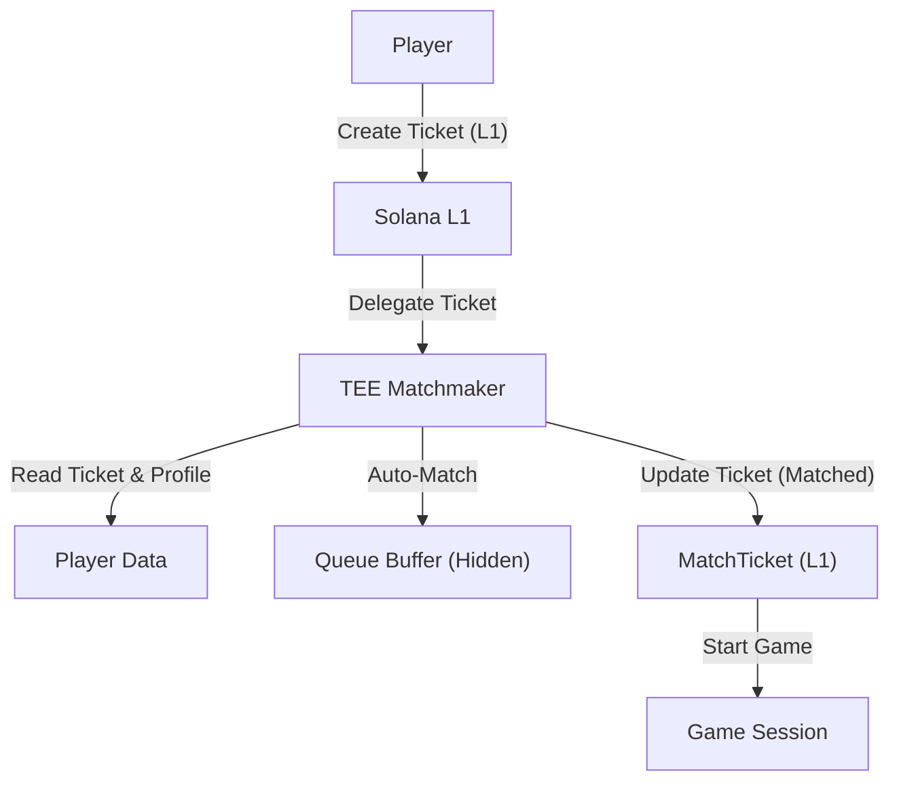

# Private Matchmaking Protocol: Technical Whitepaper

## 1. Executive Summary
The **Private Matchmaking Protocol** is a generic, privacy-preserving matchmaking infrastructure built on Solana. It enables any game developer to spin up an on-chain matchmaking queue that protects player identity and strategy data using **Trusted Execution Environments (TEEs)** via Ephemeral Rollups. This creates a "Dark Pool" for gamers—verifiable but opaque to external observers.

## 2. Core Problem
Public blockchains force transparency. In competitive gaming (e.g., RTS, MOBA, Poker), revealing the matchmaking queue publicly exposes:
- **Player Activity**: Sniping streamers or high-value targets.
- **Strategy Leakage**: Analyzing opponent loadouts/ELO before the match starts.
- **Micro-structure**: Front-running matchmaking transactions.

## 3. Solution Architecture
The protocol utilizes a **Hybrid On-Chain/Off-Chain** model:
1.  **L1 Settlement**: The queue is initialized on Solana L1.
2.  **TEE Delegation**: The queue state is immediately delegated to an Ephemeral Rollup (MagicBlock). This moves the data into a secure enclave.
3.  **Encrypted State**: Players submit transactions that are encrypted and only decrypted inside the TEE.
4.  **Proof of Match**: The TEE runs the matching logic (ELO comparison) and emits a `MatchFound` event only when a valid pair is found.

### System Diagram

## 4. Technical Specifications

### 4.1 Queue Structure (TEE)
A `Queue` is an efficient, in-memory data structure residing entirely within the TEE.
- **Privacy**: The queue state is invisible to L1 observers.
- **Speed**: Matching happens in-memory without L1 latency.
- **Tenant Isolation**: Each Game Program (Tenant) owns its own Queues.

### 4.2 Universal Adapter (CPI)
The protocol is **Game Agnostic**. It does not know what your game is.
- **Input**: Any PDA containing an 8-byte discriminator + ELO (u64/u32/i32).
- **Ownership**: The Queue verifies that the joining Player Account is owned by the expected Tenant Program.
- **Lock**: Players are "locked" (via `PlayerStatus` PDA) to prevent joining multiple queues simultaneously.

### 4.3 Delegation Mechanism
The protocol implements the `DelegateQueue` instruction which leverages the `ephemeral-rollups-sdk`.
- **Validator**: An authorized TEE validator is assigned.
- **Buffer**: A PDA buffer holds the encrypted state transition headers.
- **Undelegation**: On match completion, state *can* be settled back to L1, but typically Matchmaking state is ephemeral and discarded after the match is handed off.

## 5. Integration Flow
1.  **Initialize**: Game Dev calls `initialize_queue` -> `delegate_queue`.
2.  **Create Ticket**: Player calls `create_ticket` on L1.
3.  **Delegate**: Player calls `delegate_ticket` to authorize TEE access.
4.  **Join Queue**: Player calls `join_queue` via the TEE (encrypted).
5.  **Auto-Match**: The TEE runs matching logic and updates local ticket state.
6.  **Commit**: The TEE commits the "Matched" status back to the L1 `MatchTicket`.
7.  **Game Start**: Player calls `start_game_with_ticket`, proving the match to the game program.

## 6. Security Model
- **Privacy**: Observers see "Interaction with Matchmaker" but not *who* is in the queue or their ELO, as the Queue memory is inside the enclave.
- **Integrity**: The TEE attests that the matching logic (Code) was executed correctly on the Inputs.
- **Liveness**: If the TEE goes down, the Queue Authority can force-undelegate (after timeout) to recover funds on L1.

## 7. Known Limitations & Proposed Improvements

### 7.1 Post-Match Privacy Leak
- **Issue**: The `MatchFound` event publicly reveals `[PlayerA, PlayerB]` on L1, allowing observers to link wallet addresses to timestamps and correlate them with queue interactions.
- **Proposed Solution**: Encrypt the `MatchFound` event payload. Only the matched participants (holding the relevant private keys) can decrypt their session details. Alternatively, publish only a hashed `GameID` on L1; players query the TEE privately to check if that `GameID` belongs to them.

### 7.2 Strict Data Layout Dependency
- **Issue**: The Universal Adapter assumes a rigid `[Discriminator (8) + ELO (u64)]` layout. This breaks if tenants use custom serialization or field ordering.
- **Proposed Solution**: Implement a `Trait` or `Interface` system where tenant programs verify their own ELO layout, or standardize a `MatchmakingInterface` struct that all tenants must implement at a specific offset.

### 7.3 Encryption Handshake Details
- **Issue**: The "encrypted transaction" mechanism is under-specified.
- **Proposed Solution**: Explicitly define the usage of `ephemeral-rollups-sdk` for client-side encryption. The client performs a Diffie-Hellman key exchange with the TEE's attested public key to establish a shared secret session *before* submitting any queue data.

### 7.4 Scaling Limits
- **Issue**: Linked-list page traversal is not truly "infinite" due to compute unit (CU) limits per transaction/slot.
- **Proposed Solution**: Rephrase to "High Horizontal Scalability". Implement a "Page Registry" system rather than a linear linked list to allow parallel access and simpler management of active vs. inactive pages.

### 7.5 Crank Timing Leaks
- **Issue**: External cranks operating the queue can infer queue density and activity based on the success/failure of `process_match` calls.
- **Proposed Solution**: Utilize an internal TEE "Auto-Clock" or "Heartbeat" mechanism that runs matching logic at deterministic intervals, independent of external user transactions, or bundle matching logic with the `join_queue` event (immediate matching) to mask the processing step.
